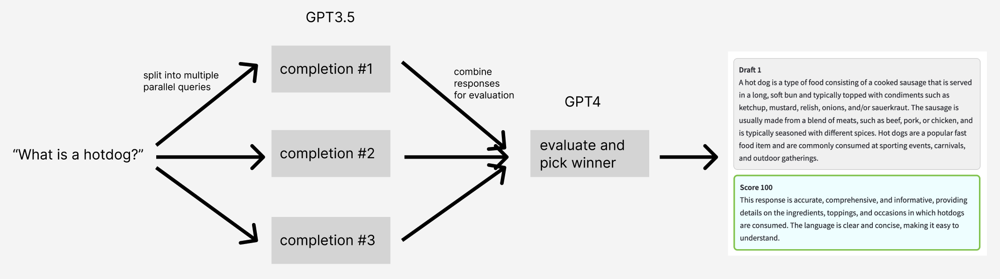

## Problem: 

I want better quality, more factual, more accurate responses

## Solution: 

Generate multiple draft responses and then use a second model to judge the answers and pick a winner, which is then returned to the user. Google's Bard uses this same approach. With this library you can apply the pattern to gpt-3.5 and gpt-4.



## What does this do?

This library will enable you to generate multiple responses and then uses a second model to evaluate those repsonses for accuracy, quality, relevance and other factors. 


<video controls autoplay muted loop>
  <source src="gladiator-demo.mp4" type="video/mp4">
  Your browser does not support the video tag.
</video>

## How it works

The number of drafts generated is set at 3 but can be configured by the user. 

The generation of multiple drafts serves the purpose of providing you with the most optimal response. By considering all potential answers and the requisite level of detail, this approach ensures that the delivered response is accurate, comprehensive, and informative.

Content is then evaluated with GPT4 which takes into account:

```
It is accurate and factual.
It is comprehensive and informative.
It is clear and easy to understand.
It is relevant to the request.
It is creative and engaging.
The quality of the language used.
The accuracy of the information.
The relevance of the information to the request.
The clarity and conciseness of the writing.
The creativity and engagement of the writing.
```

## How to use it:

```python
from Gladiator import Gladiator

gladiator = Gladiator(n=3, api_key="your key here")
winner = gladiator.run("what is a hotdog?")
print("winner = ", winner)

print("drafts generated = ", gladiator.drafts)

print("grades generated = ", gladiator.grades)

```

## Quick start guide

### Prerequisites
- An [OpenAI](https://platform.openai.com/) API Key

### How to run it locally?

Clone this repo:
```shell
$ git clone https://github.com/TheoremOne/gladiator.git
```
Navigate to the directory where the sources where cloned to:
```shell
$ cd gladiator
````

Create and activate a python virtual environment:
```shell
Windows:
$ python -m venv venv
$ .\venv\Scripts\activate

Linux:
$ python3 -m venv venv
$. venv/bin/activate
```

Upgrade pip if needed and install requirements:
```shell
$ pip install --upgrade pip
$ pip install -r requirements.txt
```


